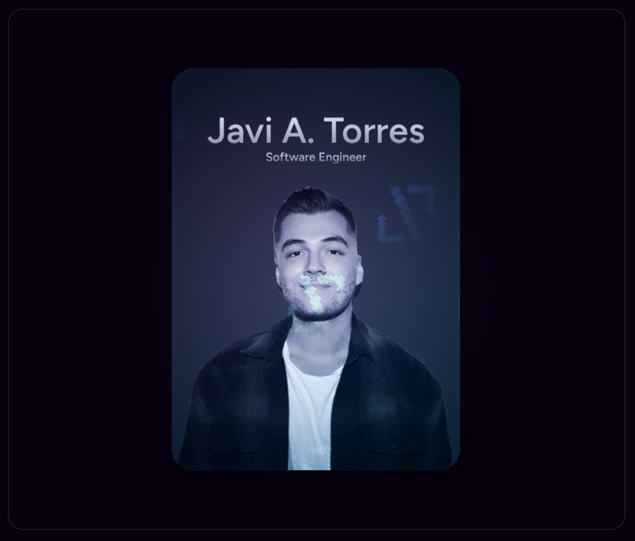

# ✨ Profile Card — React + TypeScript + Vite

Este repositorio contiene una pequeña aplicación de muestra creada con React, TypeScript y Vite que muestra un componente estilizado de tarjeta de perfil (`ProfileCard`). El propósito es servir como plantilla visual y un ejemplo de cómo construir un componente interactivo con tilting, gradientes y botones de contacto.

---

<div align="center">
  
</div>

---

## 🚀 Características

- Componente `ProfileCard` reutilizable con soporte para:
  - Avatar principal y mini-avatar.
  - Efecto de tilt (movimiento 3D responsivo según el puntero o sensores de dispositivo).
  - Glow detrás de la tarjeta y gradientes internos personalizables.
  - Botón de contacto configurable con callback.
- ⚡ Construido con React + TypeScript y Vite para desarrollo rápido con HMR.

---

## 🧰 Tech stack

- React 19
- TypeScript 5
- Vite
- ESLint (configuración mínima incluida)
- Dependencias (ver `package.json`): `framer-motion`, `lucide-react`, entre otras.

---

## ✅ Requisitos

- Node.js (versión LTS recomendada, por ejemplo 18.x o 20.x)
- npm (o puedes usar otro gestor como pnpm o yarn, adaptando los comandos)

---

## ⚙️ Instalación

Abre una terminal en la raíz del proyecto (`profile-card`) y ejecuta:

```powershell
npm install
```

---

## 🧭 Scripts útiles

Los scripts disponibles en `package.json` son:

- `npm run dev` — Inicia el servidor de desarrollo (Vite) con HMR.
- `npm run build` — Compila TypeScript y crea la build de producción (Vite).
- `npm run preview` — Sirve la build de producción localmente (Vite preview).
- `npm run lint` — Ejecuta ESLint sobre el proyecto.


---

## 🎨 Uso / Personalización rápida

El componente principal está en `src/components/ProfileCard.tsx`. En `src/App.tsx` se muestra un ejemplo de uso con varias props. A continuación un resumen de las props más relevantes que puedes ajustar:

- `avatarUrl` (string) — URL de la imagen de avatar principal (recomendado) 🖼️.
- `miniAvatarUrl` (string) — URL de la mini-avatar que aparece en la sección de usuario.
- `name` (string) — Nombre mostrado en la tarjeta.
- `title` (string) — Título o rol del usuario.
- `handle` (string) — Handle/usuario (se muestra con `@`).
- `status` (string) — Texto de estado (por ejemplo, "Open to Work").
- `contactText` (string) — Texto del botón de contacto.
- `onContactClick` (() => void) — Callback cuando se pulsa el botón de contacto (abre enlace o ejecuta acción) 🔗.
- `enableTilt` (boolean) — Habilita el efecto de tilt con puntero.
- `enableMobileTilt` (boolean) — Habilita la lectura de `deviceorientation` en móviles (requiere permiso y https) 📱.
- `behindGlowEnabled` (boolean) — Muestra u oculta un glow detrás de la tarjeta.
- `behindGlowColor`, `behindGlowSize` (string) — Personalizan color y tamaño del glow 🎨.
- `innerGradient` (string) — CSS `background-image` usado como gradiente interno.
- `iconUrl`, `grainUrl` (string) — Imágenes de patrón/ruido y iconografía usadas internamente.

---

## 📁 Estructura del proyecto

Resumen de archivos y carpetas más relevantes:

- `index.html` — HTML de entrada para Vite.
- `src/main.tsx` — Punto de entrada de React.
- `src/App.tsx` — Ejemplo de uso que monta `ProfileCard`.
- `src/components/ProfileCard.tsx` — Implementación del componente.
- `src/components/ProfileCard.css` — Estilos del componente.
- `src/index.css` y `src/App.css` — Estilos globales y de la app.
- `public/` — Imágenes y activos estáticos (avatars, patterns, etc.).
- `package.json` — Scripts y dependencias del proyecto.

---

## 🚢 Despliegue

Genera la build de producción y súbela a tu proveedor favorito (Netlify, Vercel, GitHub Pages, etc.). Pasos básicos:

```powershell
npm run build
# luego usa la carpeta `dist/` generada por Vite para el despliegue
```

Si usas Vercel o Netlify puedes simplemente conectar el repo y usar `npm run build` como comando de build. Para GitHub Pages puedes usar herramientas que sirvan una carpeta estática (por ejemplo, `gh-pages`).

---

## 📝 Notas y recomendaciones

- `enableMobileTilt` usa APIs de sensor del dispositivo que requieren permisos en algunos navegadores y HTTPS.
- Las imágenes en `public/` se refieren desde el código mediante rutas relativas (`/profile10.png`, `/grain.webp`, etc.).
- Si deseas añadir más variantes o animaciones, el componente es un buen punto de partida: está escrito con TypeScript y memoizado (`React.memo`) para evitar renders innecesarios.
- Revisa `ProfileCard.tsx` para ver los detalles de la lógica de tilt, animación y manejo de errores de carga de imágenes.

---

## 🤝 Contribuciones

Si quieres aportar mejoras o correcciones:

1. Haz un fork del repositorio.
2. Crea una rama con la mejora: `git checkout -b feat/mi-cambio`.
3. Realiza cambios y agrega tests si aplica.
4. Abre un Pull Request describiendo tus cambios.

---

*Last update: March 2026*